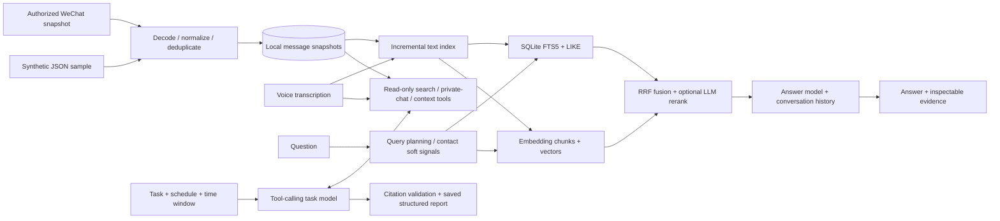
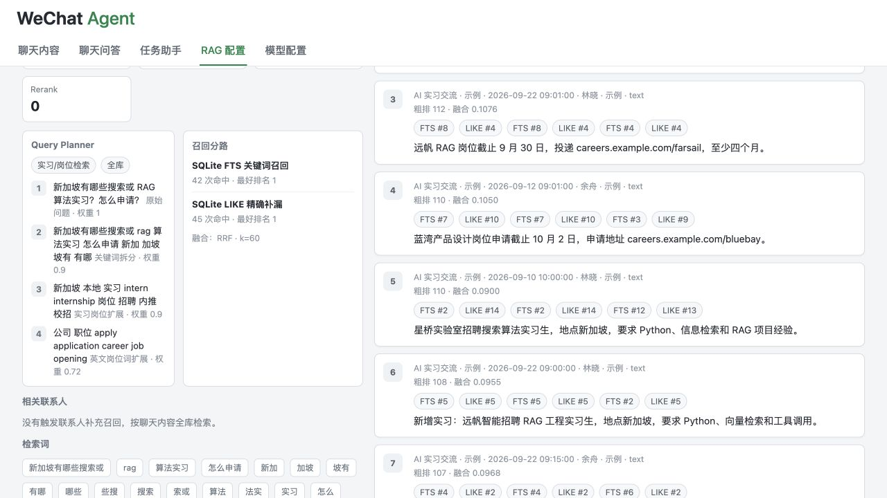
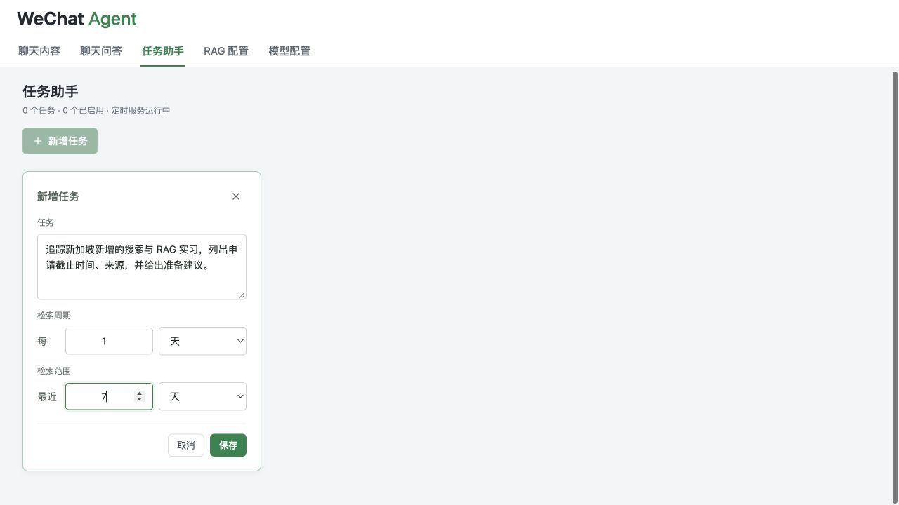
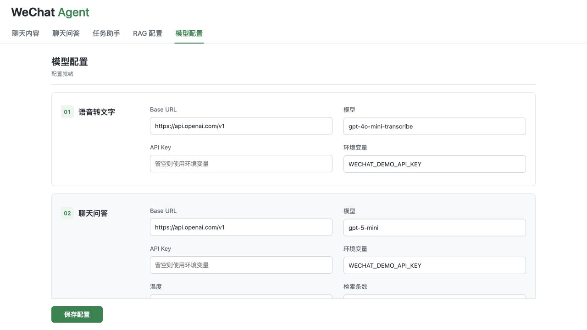

# WeChat Agent

[English](README.md) | [中文](README.zh-CN.md) | [Evaluation](eval/README.md) | [Demo guide](docs/DEMO.md)

**Find useful context buried across years of conversations, then turn it into follow-up actions.**

An internship link in a group, a friend's preparation advice in a private chat,
and a later deadline correction should not require three manual searches.
WeChat Agent brings these scattered messages into a local, inspectable knowledge
base: search, ask follow-up questions, check the evidence, and schedule recurring
information-tracking tasks. It never sends WeChat messages on your behalf.


## One-Minute Overview

| Need | What the project does |
|---|---|
| Import and revisit history | Read authorized local WeChat snapshots; merge shards, resolve contacts, paginate chats and display supported media |
| Avoid rebuilding everything | Append new messages; update changed voice transcripts and invalidate affected semantic chunks |
| Ask across conversations | Combine semantic and keyword retrieval, use contacts as soft signals, fuse with RRF and optionally rerank with an LLM |
| Continue the conversation | Save multi-turn Q&A and show retrieved evidence; background jobs survive browser navigation |
| Track something over time | Set a goal, interval and lookback window; a tool-calling assistant searches messages and saves structured findings and suggestions |
| Inspect and control the system | View query plans, recall branches and index logs; configure five model roles separately |

## Architecture



**Actual stack:** Python 3.9+, SQLite/FTS5, HTML/CSS/JavaScript, OpenAI-compatible
model APIs, PyCryptodome and Zstandard. Retrieval and scheduling are implemented
in this repository; **it does not use LlamaIndex or Streamlit**. Vectors are
stored in SQLite and scored locally, not in an external vector DB. Reranking
uses a chat-model relevance prompt, not a dedicated cross-encoder.

See [code map and design boundaries](docs/ARCHITECTURE.md).

## Run the Public Sample

No WeChat installation, private history, decryption key or API key is needed to
browse and inspect **40 fictional messages in 6 conversations**.

```bash
git clone https://github.com/Fongkai777/wechat-agent.git
cd wechat-agent
python3 -m venv .venv
source .venv/bin/activate
python -m pip install -r requirements.txt

python -m wechat_agent.demo init       # import 30 fictional messages
python -m wechat_agent.demo index      # build the initial text index
python -m wechat_agent.demo append     # import 10 additional messages
python -m wechat_agent.demo index      # incremental update: +10, not a rebuild
python -m wechat_agent.demo serve
```

Open [localhost:8787](http://127.0.0.1:8787). The sample stores everything in
ignored `.demo/`; it never falls back to private source or model settings.
If port 8787 is occupied, it exits instead of silently opening another port.
Use the RAG tab's retrieval debugger without credentials. Q&A generation, task
execution, embedding and transcription require model configuration and incur
provider charges. Embedding/reranking are disabled in the initial sample config.

For your own data, see [private-data setup](docs/USAGE.md) and the
[version-dependent extraction guide](docs/KEY_EXTRACTION.md).

## Product Views

These are screenshots of the **running application with synthetic data**, not
private conversations or invented online model results.

<details><summary>Index preparation and retrieval debugging</summary>




</details>

<details><summary>Recurring tasks and independent model settings</summary>




</details>

[75-second recording script and reproducible demo steps](docs/DEMO.md).
An online end-to-end recording has not yet been published; no placeholder video
or fabricated answer is presented as a live run.

## Retrieval Quality, Not Just an API Wrapper

The [16-question evaluation](eval/results/local/REPORT.md) exercises exact
entities, cross-chat evidence, new imports, duplicate postings, corrections,
ambiguous follow-ups and missing information.

**Measured local-only baseline, top 8:** correct-chat hit **15/15** answerable
questions; all annotated evidence retrieved **14/15**. One additional question
has no answer in the corpus and is excluded from those denominators. The failed
case and every retrieved message are retained in the report.

This tiny authored set is not production accuracy. Cloud embedding/reranking,
answer completeness and semantic citation support have **not** been scored by
this offline run. The optional live runner and review rubric keep those separate.

```bash
python scripts/evaluate_retrieval.py
python -m unittest discover -s tests -p 'test_*.py'
node --test tests/test_*.cjs
python scripts/privacy_check.py
```

## Limits and Next Steps

- Local WeChat extraction is version-dependent; history/media must exist locally.
- Retrieval plans from the latest question; saved dialogue helps generation,
  but ambiguous follow-ups still need retrieval-side rewriting.
- Keyword matching can over-rank negated statements. A missing cross-chat detail
  motivates better context expansion and measured reranking.
- Vectors are scored in-process; large archives need profiling before claiming ANN-scale performance.
- Tasks search synced snapshots directly, not the Q&A vector index. Wide time
  windows increase scan cost and context size. Scheduling requires an awake computer and running service.
- Next: held-out questions, local/semantic/hybrid/rerank ablations, citation-support
  review, query rewriting and stage-level latency/token accounting.

## Privacy and Credits

The public sample is entirely fictional. Private databases, keys, transcripts,
caches, recordings and config are excluded from Git. Cloud features transmit
selected text/audio to the configured provider; local storage does not mean
offline inference. Use only authorized data. See [publication audit](docs/PRIVACY.md).

Extraction research and helper references:
[wechat-db-decrypt-macos](https://github.com/Thearas/wechat-db-decrypt-macos),
[wechat-chat-history-mac](https://github.com/BIBOYANG425/wechat-chat-history-mac),
[wechat-suite](https://github.com/raclen/wechat-suite).
Review upstream licenses before redistribution. Not affiliated with Tencent/WeChat.
