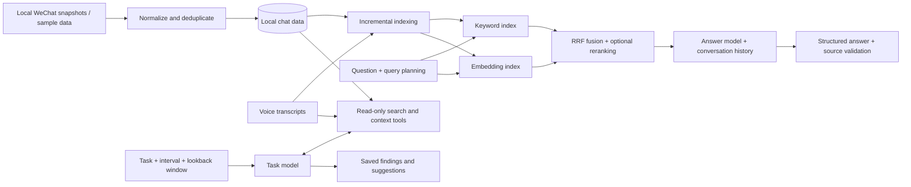

# WeChat Agent

[English](README.md) | [中文](README.zh-CN.md)

[Features](#what-you-can-do) · [Architecture](#how-it-works) · [Deployment](#installation-and-configuration) · [Models](#model-configuration) · [Usage](#using-the-app) · [Maintenance](#maintenance)

**A personal knowledge assistant for your WeChat conversations.**

WeChat Agent turns scattered private and group messages into a searchable
knowledge base. Find earlier discussions, ask questions across conversations,
and schedule tasks that bring relevant updates back to you.

An opportunity shared in a group and a friend's advice in a private chat can
be retrieved together, with links to the original evidence. Recurring tasks
extend this from answering questions to tracking information over time.


*All screenshots use fictional sample conversations.*

## What You Can Do

### Ask Across Conversations

Ask questions in natural language, combine context from different chats, and
continue with follow-up questions. Answers include expandable sources showing
the conversation, sender, time and original text. Conversations are saved, and
background requests continue when you switch tabs or close the page.

Examples: “What internships have been shared recently?” or “What advice did my
friend give me about preparing for the interview?”


### Set Recurring Tasks

Describe what to look for, choose an execution interval and set a lookback
window. The assistant selects read-only search tools, retrieves messages within
that window, and saves findings and suggestions for each run. Tasks can also
be run immediately, paused or reviewed through their execution history.

Examples include checking private conversations you have not replied to,
tracking new internship postings, or collecting restaurant recommendations.
The assistant provides suggestions; it does not send WeChat messages.


### Browse and Prepare Your History

Browse private and group chats in a familiar layout, search contacts, and load
older messages on demand. The app supports automatic and manual sync from
configured local WeChat data, supported local media, and cached voice transcripts.

Prepare retrieval data in one sequence: voice transcription, incremental text
indexing, then semantic indexing. New messages are appended; changed transcripts
update the affected records and semantic chunks. The RAG workspace exposes index
status, retrieval diagnostics and scheduled preparation.

<details>
<summary>Index preparation and retrieval settings</summary>


</details>

## How It Works

Two paths share the local chat data: **hybrid retrieval for Q&A** and
**tool-driven search for scheduled tasks**.



- **Hybrid retrieval:** rule-based query planning, semantic and keyword recall,
  contact associations as soft signals, RRF fusion and optional LLM reranking.
- **Evidence-backed answers:** the model returns conclusions and source IDs;
  code validates the references and renders source metadata from retrieved records.
- **Task execution:** a local scheduler runs a tool-calling loop over synced
  messages. Task search is separate from the Q&A vector index.
- **Independent model roles:** configure transcription, Q&A, tasks, embeddings
  and reranking separately.

| Layer | Technology |
|---|---|
| Backend and scheduling | Python 3.9+, local HTTP server and background jobs |
| Storage and retrieval | SQLite, FTS5/LIKE, embedding vectors scored locally |
| Model integration | OpenAI-compatible APIs; JSON-schema answers and tool calling |
| Frontend | HTML, CSS and JavaScript |
| Local data processing | PyCryptodome and Zstandard |

See the [architecture and code map](docs/ARCHITECTURE.md) for implementation details.

## Installation and Configuration

This guide deploys the application locally on **macOS with WeChat 4.x**.
You need your own logged-in WeChat account, locally synced history, Python 3.9+
and Apple's Command Line Tools. Database-key extraction is version-dependent;
it is not guaranteed to work on every WeChat/macOS release. There is no Docker
or public-server setup in this guide: extraction needs the local client, and
the web service has no built-in authentication.

### 1. Install the Application

If Command Line Tools are not installed, run `xcode-select --install` and finish
the installer first. Then:

```bash
git clone https://github.com/Fongkai777/wechat-agent.git
cd wechat-agent
python3 -m venv .venv
source .venv/bin/activate
python -m pip install -r requirements.txt
```

Run subsequent commands from the repository root with this environment active.
For cloud voice transcription, also install the local SILK decoder:

```bash
python -m pip install 'pilk>=0.2'
```

No Node.js build is required to run the web interface.

### 2. Prepare Your WeChat Data

Locate the account directory containing `db_storage/` and usually `msg/`.
A common macOS location is:

```text
~/Library/Containers/com.tencent.xinWeChat/Data/Documents/xwechat_files/<account-folder>/
```

Use your actual account folder; the path may differ between client versions.
Quit WeChat before copying to avoid a changing database snapshot. Copy the
**whole** `db_storage` directory into the project, preserving any `-wal` and
`-shm` files. Copy its sibling `msg` directory too if you need local media.
Do not overwrite or modify the original WeChat files.

```text
wechat-agent/
  db_storage/
    message/message_0.db
    contact/contact.db
    session/session.db
    ...
  msg/                    # optional media; may be large
```

Inspect the copy:

```bash
python -m wechat_agent inspect
```

### 3. Obtain the Database Keys

**Database keys and model API keys are different.** The app reads matching
database keys from `all_keys.json`; an API key cannot decrypt WeChat data.

Reopen WeChat and log in to the same account as the copied databases.
The included LLDB scanner attempts to recover keys from that running process
and verifies them against the copied databases. Run it from your own macOS
Terminal:

```bash
bash scripts/key_scan_python_lldb.sh
```

The wrapper requests administrator permission and uses the Command Line Tools
Python, not the project's virtualenv or Conda Python. If successful, it writes
`all_keys.json` in the project root. Opening chats, contacts and search can
cause additional databases to load; this does not mean every conversation has
a separate key.

If attachment is denied, no keys are found, or LLDB cannot load, follow the
[key extraction and troubleshooting guide](docs/KEY_EXTRACTION.md).
File-access permission and process-debugging permission are different. Do not
disable SIP or re-sign WeChat as a routine install step; these changes affect
system security or application integrity.

Keep `all_keys.json` local and protect it as sensitive data. Then decrypt:

```bash
python -m wechat_agent doctor --keys all_keys.json
python -m wechat_agent decrypt --keys all_keys.json
```

Decrypted copies are written to `decrypted/`; original databases are unchanged.
Check the command's failures and skipped databases before continuing, especially
message, contact and session databases. Creating a JSON file with no matched
keys is not a successful extraction.

### 4. Configure Your Account and Start

A copied `db_storage/` path no longer identifies your account. Create `web_cache/`
and a local `web_cache/source.json` in the repository to identify your outgoing messages:

```json
{
  "db_storage": "db_storage",
  "media_root": "msg",
  "account": "YOUR_WECHAT_ID"
}
```

Replace `YOUR_WECHAT_ID` with your sender ID in the database, not a nickname.
For an original account folder shaped like `wxid_example_ab12`, the ID is
`wxid_example`, without the final directory suffix. Use this rule only for
folders matching that form. The `--account` startup argument overrides this
setting. An incorrect ID affects message alignment and unreplied-chat analysis.

Start the service:

```bash
bash scripts/start_web.sh
```

Open [http://127.0.0.1:8787](http://127.0.0.1:8787).
Keep this terminal running; `Ctrl+C` stops the service. The default date filter
shows records from 2023-01-01 onward without deleting older source data.
To change it, pass, for example, `--since 2020-01-01` to the startup script.

#### Continuous Sync (Optional)

**For continuous sync**, point the service at the live account directory,
rather than the static copy. Update the same `web_cache/source.json` with your
absolute source paths and sender ID:

```json
{
  "db_storage": "/absolute/path/to/account-folder/db_storage",
  "media_root": "/absolute/path/to/account-folder/msg",
  "account": "YOUR_WECHAT_ID"
}
```

Keep the matching `all_keys.json` in the project root. If macOS blocks reading
the container, grant Full Disk Access to the terminal application launching the
server. Restart after changing paths or permissions:

```bash
bash scripts/restart_web.command
```

This script stops the listener on **8787**; use it only when that port belongs
to this project, and wait for active work to finish first. The service checks
for database changes every 60 seconds; **Sync latest messages** checks manually.
A copied folder stays static until you replace its contents. Syncing messages
does not itself update RAG indexes or trigger model calls.

## Model Configuration

### Services and Credentials

Open **Model Settings** and set the service base URL, model ID and API key for
the roles you want to use. For OpenAI, create a key through the
[official API setup guide](https://developers.openai.com/api/docs/quickstart);
the base URL for this application's OpenAI integration is
`https://api.openai.com/v1`. For another compatible provider, use its credentials,
model IDs and endpoint. Do not append `/chat/completions` to the base URL.

| Configuration | Purpose | API capability needed |
|---|---|---|
| Voice transcription | Convert local voice messages to text | Audio transcription |
| Chat Q&A | Answer questions with source citations | Chat completions + strict JSON Schema |
| Task assistant | Execute scheduled or manual tasks | Chat completions + tool calling + strict JSON Schema |
| Embedding | Build and query semantic indexes | Embeddings |
| Rerank | Reorder retrieved candidates | Chat completions; this is LLM-based reranking |

### Defaults and Persistence

The current defaults are `gpt-4o-mini-transcribe`, `gpt-5-mini` for Q&A and tasks,
`text-embedding-3-small`, and `gpt-5-nano` for reranking. These are configuration
defaults, not guarantees of availability; choose models your provider/account
supports. Compatible model services may implement different API capabilities.

Save the configuration before preparing indexes. Embedding and reranking can
inherit the Q&A URL/key when left blank. Q&A, tasks and voice have separate
profiles; they can also read the configured API-key environment variable
(default `OPENAI_API_KEY`) from the server process. Settings entered in the UI
are stored locally in `web_cache/llm_config.json`, so protect this directory.
Disable optional embedding/reranking if you do not intend to use them.
Cloud calls transmit relevant content and may incur usage charges.

## Using the App

### Prepare Indexes

In **RAG Configuration**, run **Prepare Retrieval** to execute:

```text
Voice transcription -> incremental text index -> incremental semantic index
```

Configure transcription first when local voice messages are present. Existing
transcripts are reused. Text and semantic indexes can also be updated separately;
semantic indexing requires an enabled, configured embedding service.

### Chat, Q&A and Tasks

| Workspace | How to use it |
|---|---|
| Chat content | Select a contact/group, browse history, expand supported media, or sync new messages |
| Chat Q&A | Create a conversation, ask a question, continue with follow-ups and expand sources |
| Task assistant | Enter a task, choose every N hours/days and a recent N days/weeks/months window; save or run immediately |
| RAG Configuration | Update indexes, inspect retrieval and schedule automatic preparation |
| Model Settings | Change each model role's provider, credentials and parameters |

Task tools read synced chat data and saved transcripts directly; they do not
require the Q&A vector index. Tasks save results and history without sending
messages to WeChat. Both recurring tasks and scheduled index preparation need
a running server and an awake computer.

## Maintenance

New messages normally need an incremental index update, not a full rebuild.
Private configuration, Q&A/task history and indexes live under `web_cache/`;
decrypted databases live under `decrypted/`. Do not delete these directories
as an upgrade step. V2 images may require a separate `image_aes_key`; missing
media or audio cannot be recovered from message metadata alone.

### Installation Check and Troubleshooting

Without private databases or keys, validate installation, synthetic import,
incremental indexing, static assets and local API responses with:

```bash
python scripts/smoke_test.py
```

This uses temporary fictional data and no cloud calls. Its temporary server
closes automatically and never occupies 8787. See the [sample-data guide](docs/DEMO.md)
for an interactive session and the [usage guide](docs/USAGE.md) for operational details.

| Symptom | Check first |
|---|---|
| No databases or zero matching keys | Data paths, logged-in account, extraction permissions and client version |
| All messages appear incoming | Your sender ID in `web_cache/source.json`'s `account` field |
| Recent messages missing | Live source versus static copy; terminal file-access permissions |
| Port 8787 is occupied | Check the existing service; do not start duplicates or stop unrelated processes |
| Model request fails | The role's base URL, credentials, model capabilities, network and provider limits |

Passing this check does not establish key-extraction compatibility or verify
your cloud model access.

## Limitations and Roadmap

- Only locally available history and media can be read. Media decoding depends
  on format, keys and cache availability.
- Saved history helps answer generation; retrieval-side rewriting of ambiguous
  follow-up questions is still planned.
- Source validation makes answers inspectable, but does not guarantee that every
  conclusion is supported by its cited text.
- Tasks require a running service and an awake computer. Broad lookback windows
  can increase processing time and model usage.
- Next priorities: multi-turn query rewriting, broader retrieval evaluation,
  citation-support checks and performance improvements for large archives.

## Privacy and Credits

Chat data is stored locally. Cloud model features send selected text or audio
to the configured provider; this is not an offline-only application. Use only
data you are authorized to process. Private databases, keys and caches are
excluded from Git. The server is intended for local use, not public exposure.

Extraction research and helper references:
[wechat-db-decrypt-macos](https://github.com/Thearas/wechat-db-decrypt-macos),
[wechat-chat-history-mac](https://github.com/BIBOYANG425/wechat-chat-history-mac),
[wechat-suite](https://github.com/raclen/wechat-suite).
Review upstream licenses before redistribution. Not affiliated with Tencent or WeChat.
