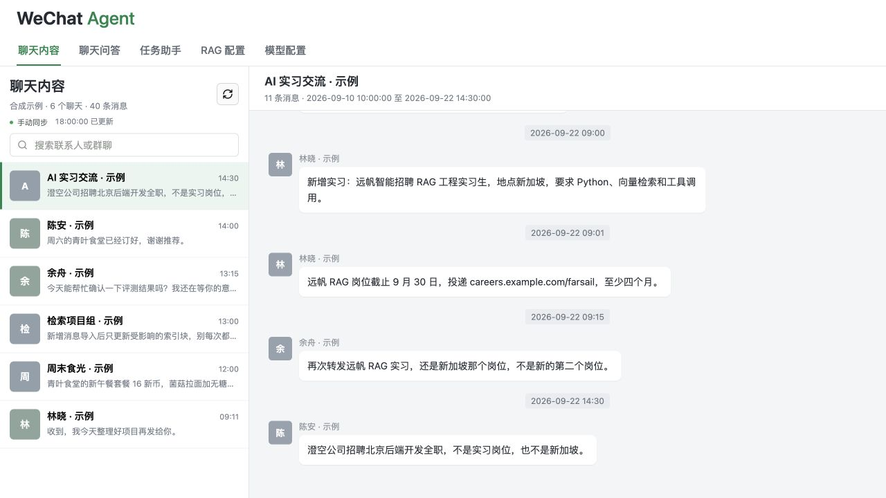
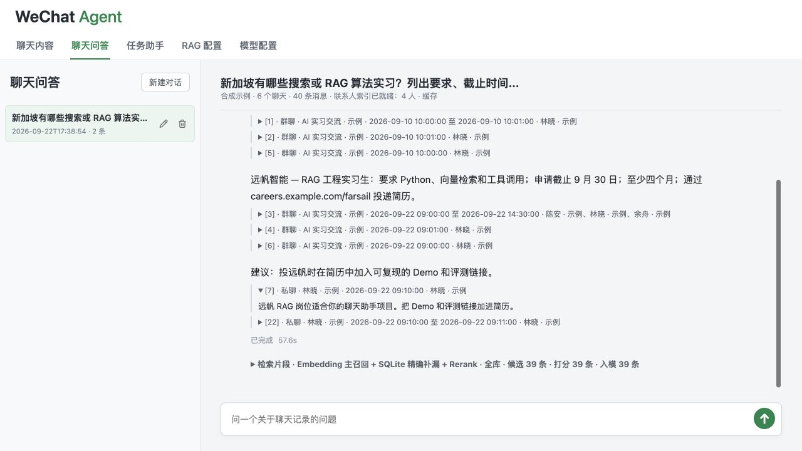
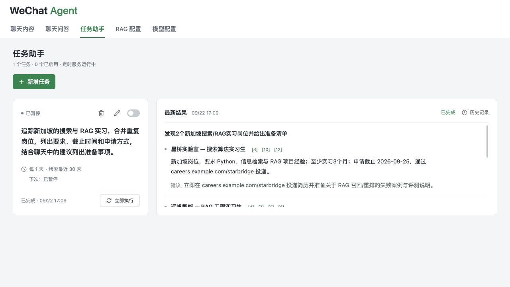
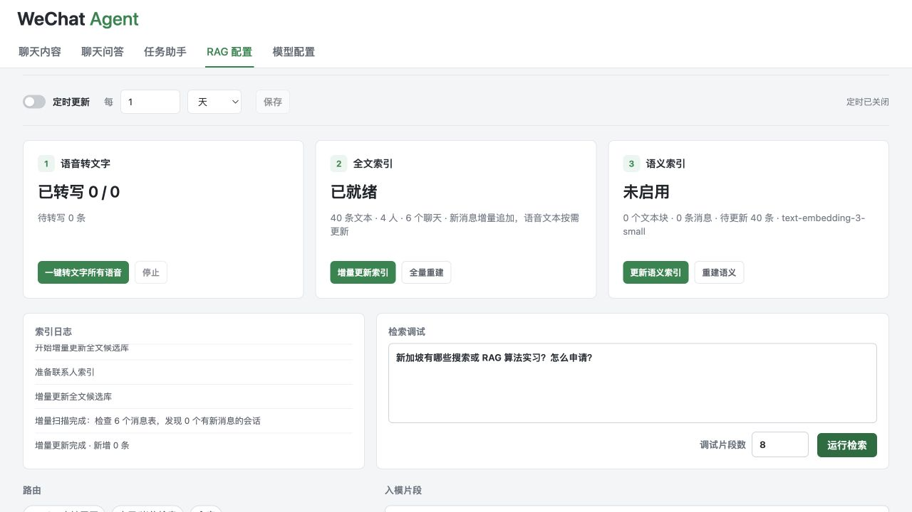
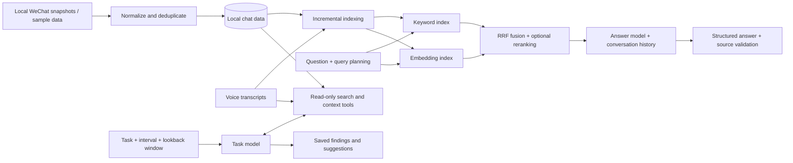

# WeChat Agent

[English](README.md) | [中文](README.zh-CN.md)

**A personal knowledge assistant for your WeChat conversations.**

WeChat Agent turns scattered private and group messages into a searchable
knowledge base. Find earlier discussions, ask questions across conversations,
and schedule tasks that bring relevant updates back to you.

An opportunity shared in a group and a friend's advice in a private chat can
be retrieved together, with links to the original evidence. Recurring tasks
extend this from answering questions to tracking information over time.



*All screenshots use fictional sample conversations.*

## What You Can Do

### Ask Across Conversations

Ask questions in natural language, combine context from different chats, and
continue with follow-up questions. Answers include expandable sources showing
the conversation, sender, time and original text. Conversations are saved, and
background requests continue when you switch tabs or close the page.

Examples: “What internships have been shared recently?” or “What advice did my
friend give me about preparing for the interview?”



### Set Recurring Tasks

Describe what to look for, choose an execution interval and set a lookback
window. The assistant selects read-only search tools, retrieves messages within
that window, and saves findings and suggestions for each run. Tasks can also
be run immediately, paused or reviewed through their execution history.

Examples include checking private conversations you have not replied to,
tracking new internship postings, or collecting restaurant recommendations.
The assistant provides suggestions; it does not send WeChat messages.



### Browse and Prepare Your History

Browse private and group chats in a familiar layout, search contacts, and load
older messages on demand. The app supports automatic and manual sync from
configured local WeChat data, supported local media, and cached voice transcripts.

Prepare retrieval data in one sequence: voice transcription, incremental text
indexing, then semantic indexing. New messages are appended; changed transcripts
update the affected records and semantic chunks. The RAG workspace exposes index
status, retrieval diagnostics and scheduled preparation.

<details>
<summary>Index preparation and retrieval settings</summary>



</details>

## How It Works

Two paths share the local chat data: **hybrid retrieval for Q&A** and
**tool-driven search for scheduled tasks**.



- **Hybrid retrieval:** rule-based query planning, semantic and keyword recall,
  contact associations as soft signals, RRF fusion and optional LLM reranking.
- **Evidence-backed answers:** the model returns conclusions and source IDs;
  code validates the references and renders source metadata from retrieved records.
- **Task execution:** a local scheduler runs a tool-calling loop over synced
  messages. Task search is separate from the Q&A vector index.
- **Independent model roles:** configure transcription, Q&A, tasks, embeddings
  and reranking separately.

| Layer | Technology |
|---|---|
| Backend and scheduling | Python 3.9+, local HTTP server and background jobs |
| Storage and retrieval | SQLite, FTS5/LIKE, embedding vectors scored locally |
| Model integration | OpenAI-compatible APIs; JSON-schema answers and tool calling |
| Frontend | HTML, CSS and JavaScript |
| Local data processing | PyCryptodome and Zstandard |

See the [architecture and code map](docs/ARCHITECTURE.md) for implementation details.

## Quick Start

Try the app with **40 fictional messages in 6 conversations**. Browsing and
local keyword retrieval require neither WeChat nor an API key.

```bash
git clone https://github.com/Fongkai777/wechat-agent.git
cd wechat-agent
python3 -m venv .venv
source .venv/bin/activate
python -m pip install -r requirements.txt

python -m wechat_agent.demo init       # import the initial sample
python -m wechat_agent.demo index      # build the text index
python -m wechat_agent.demo append     # add new sample messages
python -m wechat_agent.demo index      # update the index incrementally
python -m wechat_agent.demo serve
```

Open [localhost:8787](http://127.0.0.1:8787). The demo keeps its data and settings
in `.demo/`, separate from private data. If the port is occupied, stop the
existing server before starting the demo.

Configure models in the **Model Settings** tab to enable generated answers,
tasks, embeddings and transcription. These features may incur provider charges.
Q&A requires strict JSON-schema support; task execution additionally requires
tool calling. Embedding and reranking start disabled in the sample.

For your own history, follow the [local-data setup guide](docs/USAGE.md).
WeChat extraction depends on client version and local data availability.

## Limitations and Roadmap

- Only locally available history and media can be read. Media decoding depends
  on format, keys and cache availability.
- Saved history helps answer generation; retrieval-side rewriting of ambiguous
  follow-up questions is still planned.
- Source validation makes answers inspectable, but does not guarantee that every
  conclusion is supported by its cited text.
- Tasks require a running service and an awake computer. Broad lookback windows
  can increase processing time and model usage.
- Next priorities: multi-turn query rewriting, broader retrieval evaluation,
  citation-support checks and performance improvements for large archives.

## Privacy and Credits

Chat data is stored locally. Cloud model features send selected text or audio
to the configured provider; this is not an offline-only application. Use only
data you are authorized to process. Private databases, keys and caches are
excluded from Git. The server is intended for local use, not public exposure.

Extraction research and helper references:
[wechat-db-decrypt-macos](https://github.com/Thearas/wechat-db-decrypt-macos),
[wechat-chat-history-mac](https://github.com/BIBOYANG425/wechat-chat-history-mac),
[wechat-suite](https://github.com/raclen/wechat-suite).
Review upstream licenses before redistribution. Not affiliated with Tencent or WeChat.
