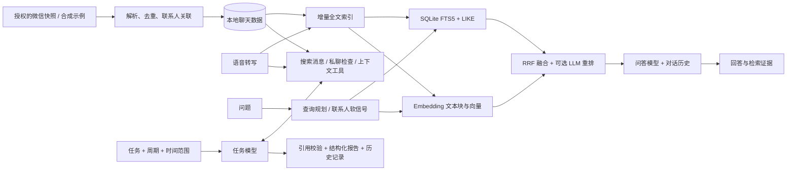

# WeChat Agent

[English](README.md) | [中文](README.zh-CN.md) | [评测](eval/README.md) | [Demo](docs/DEMO.md)

**从分散的聊天记录里找回有用信息，再把它变成可跟进的事项。**

一个实习链接在群里，朋友的面试建议在私聊里，截止时间又在后续消息里更新。
WeChat Agent 把这些信息整理为本地、可核查的知识库：搜索历史、连续追问、
查看依据，也可以设置周期任务，持续追踪重要信息。它只提供建议，不代替你发送微信消息。


## 一分钟了解

| 需求 | 已实现的能力 |
|---|---|
| 导入、回顾聊天 | 读取有权访问的本地快照，合并消息分片、解析联系人、分页浏览及展示支持的媒体 |
| 新消息不重复全量处理 | 增量追加文本；语音转写变化时更新对应记录及受影响的向量块 |
| 跨私聊、群聊查信息 | 语义与关键词多路召回、联系人软信号、RRF 融合、可选 LLM 重排 |
| 连续追问、核查依据 | 保存多轮问答及检索证据，后台执行不因切换页面而中断 |
| 主动追踪信息 | 配置任务、执行周期和回看范围；模型通过只读工具检索，保存结构化结果与建议 |
| 看得懂、能控制 | 展示查询计划、召回分路与索引日志；五类模型分别配置 |

## 系统架构



**真实技术栈：** Python 3.9+、SQLite/FTS5、HTML/CSS/JavaScript、OpenAI 兼容 API、
PyCryptodome、Zstandard。检索与调度逻辑在本仓库实现，**没有使用 LlamaIndex 或 Streamlit**。
向量存于 SQLite，在进程内计算相似度；当前重排是用聊天模型做相关性判断，不是专用 Cross-Encoder。

代码入口与链路边界见[架构说明](docs/ARCHITECTURE.md)。

## 用示例数据运行

不需要安装微信，也不需要真实聊天、数据库密钥或 API key，就能浏览并检索 **6 个会话、40 条虚构消息**。

```bash
git clone https://github.com/Fongkai777/wechat-agent.git
cd wechat-agent
python3 -m venv .venv
source .venv/bin/activate
python -m pip install -r requirements.txt

python -m wechat_agent.demo init       # 导入 30 条虚构消息
python -m wechat_agent.demo index      # 首次建索引
python -m wechat_agent.demo append     # 追加 10 条
python -m wechat_agent.demo index      # 增量更新，只新增 10 条
python -m wechat_agent.demo serve
```

访问 [localhost:8787](http://127.0.0.1:8787)。示例数据和配置都放在被 Git 忽略的 `.demo/`，
不会回退读取私人数据源或已有模型配置。端口被占用会退出，不会自动换端口。

RAG 页的本地检索调试不需要 key。生成回答、执行任务、Embedding 和语音转写需要配置对应模型，
可能产生费用；示例初始配置关闭了 Embedding 和重排。
真实数据接入见[使用指南](docs/USAGE.zh-CN.md)与[密钥提取及版本限制](docs/KEY_EXTRACTION.md)。

## 界面预览

截图来自**运行中的真实应用和合成数据**，不含真实聊天，也没有用预写答案冒充模型运行结果。

<details><summary>增量索引与检索过程</summary>


</details>

<details><summary>周期任务与独立模型配置</summary>


</details>

[75 秒 Demo 分镜及复现步骤](docs/DEMO.md)已准备好。在线端到端录屏尚未发布，不放占位视频链接。

## 简单但可核查的评测

[16 个问题](eval/cases.json)覆盖实体定位、跨会话信息、增量数据、重复转发、
时间更正、模糊追问和无证据场景。[报告](eval/results/local/REPORT.md)保留了每条检索结果和失败案例。

**本地检索基线，Top-8：** 15 个有答案问题中，正确会话命中 **15/15**，
标注证据全部找齐 **14/15**。另有 1 个无答案问题，不计入上述分母。

这只是小规模人工构造数据上的检索测量，不能代表真实语料准确率。
本轮没有测云端 Embedding/重排，也没有把答案完整性、引用语义正确性冒充为已评测指标。
仓库提供可选在线运行方式及独立审核表。

```bash
python scripts/evaluate_retrieval.py
python -m unittest discover -s tests -p 'test_*.py'
node --test tests/test_*.cjs
python scripts/privacy_check.py
```

## 已知限制与下一步

- 微信解析依赖客户端版本、密钥及本地已同步的历史和媒体。
- 当前检索规划主要基于本轮问题；对话历史传给回答模型，但模糊追问仍需检索侧查询改写。
- 关键词排序可能把否定句排得过高；本轮也发现一例跨会话证据缺失，后续需评估上下文扩展与重排。
- 向量采用进程内相似度计算，尚不能宣称具备大规模 ANN 检索性能。
- 任务直接搜索已同步快照，不复用问答向量索引。宽时间窗会增加扫描量与上下文成本；定时执行需要服务在线且电脑唤醒。
- 下一步：独立测试集、多路召回消融、引用支持度审核、多轮查询改写、分阶段延迟与 token 统计。

## 隐私与致谢

公开示例全部虚构。私人数据库、密钥、语音转写、缓存和配置不提交到 Git。
云端功能会将相关文本或音频发送给所配置的服务商；“本地存储”不等于“离线推理”。
仅处理你有权访问的数据。见[公开发布检查记录](docs/PRIVACY.md)。

提取与解析参考了
[wechat-db-decrypt-macos](https://github.com/Thearas/wechat-db-decrypt-macos)、
[wechat-chat-history-mac](https://github.com/BIBOYANG425/wechat-chat-history-mac)、
[wechat-suite](https://github.com/raclen/wechat-suite)。
再分发上游代码前请确认许可证。本项目不是腾讯或微信官方产品。
