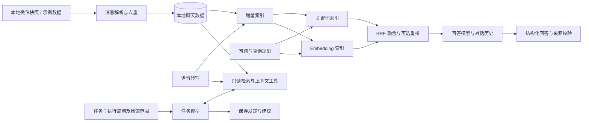

# WeChat Agent

[English](README.md) | [中文](README.zh-CN.md)

**把微信聊天记录变成可检索、可追问、可持续跟进的个人知识库。**

WeChat Agent 帮你从分散的私聊和群聊中找回信息：回顾过去的讨论，
用自然语言跨会话提问，也可以设置周期任务，持续整理你关心的动态。

群里分享的实习机会、朋友私聊中的准备建议，不必再分别翻找。
你可以把它们放在一个问题里检索、汇总，并展开原文核对。
对于需要持续关注的信息，则交给定时任务跟进。


*页面截图均使用虚构示例数据。*

## 核心功能

### 跨会话问答

用自然语言查询聊天记录，关联不同会话中的信息，并通过多轮对话继续追问。
回答附带可展开的来源，展示会话、发送者、时间和原文。
问答历史自动保存，切换页面或关闭网页不会中断后台请求。

例如：“最近有哪些实习机会？”“朋友之前给了我哪些面试准备建议？”


### 周期任务助手

填写任务内容，设置执行周期与检索范围。助手自主选择只读检索工具，
在指定时间窗内查找消息，将发现和建议保存为每次执行的结果。
任务支持立即执行、暂停，以及查看历史结果。

你可以用它检查尚未回复的私聊、追踪新增实习信息，或整理朋友推荐的餐厅。
助手只提供信息和建议，不会代替你发送微信消息。


### 聊天浏览与数据准备

以熟悉的聊天布局浏览私聊和群聊，搜索联系人，按需加载历史消息。
支持从已配置的本地微信数据自动或手动同步，展示支持的本地媒体，
并保存语音转写结果。

语音转文字、全文索引和语义索引可以依次执行。
新消息增量追加，转写变化更新对应记录及受影响的语义块。
RAG 配置页集中展示索引状态、检索调试和定时更新设置。

<details>
<summary>索引准备与检索配置</summary>


</details>

## 技术概览

系统基于同一份本地聊天数据，提供两条执行路径：
**面向问答的混合检索**，以及**面向周期任务的工具调用检索**。



- **混合检索**：规则驱动的查询规划、语义与关键词多路召回、联系人关联软信号、
  RRF 融合，以及可选的 LLM 重排。
- **可核查的回答**：模型返回结论和来源编号，代码校验引用，
  并从检索记录中生成会话、发送者和时间等来源信息。
- **任务执行**：本地调度器驱动模型调用工具，读取已同步消息。
  任务检索与问答向量索引是独立路径。
- **模型独立配置**：语音转写、聊天问答、任务助手、Embedding 和重排分别配置。

| 模块 | 技术 |
|---|---|
| 后端与调度 | Python 3.9+、本地 HTTP 服务、后台任务 |
| 存储与检索 | SQLite、FTS5/LIKE、进程内向量相似度计算 |
| 模型接入 | OpenAI 兼容 API、JSON Schema 结构化回答、工具调用 |
| 前端 | HTML、CSS、JavaScript |
| 本地数据处理 | PyCryptodome、Zstandard |

实现细节和代码入口见[架构说明](docs/ARCHITECTURE.md)。

## 部署与配置

以下流程是在 **macOS + 微信 4.x** 上部署完整应用。
需要你自己的已登录微信账号、本地已同步的聊天记录、Python 3.9+ 和
Apple Command Line Tools。数据库密钥提取受微信与 macOS 版本影响，
并不保证所有版本都能成功。这里采用本机部署，不提供 Docker 或公网部署方案：
密钥提取需要本地客户端，网页服务也没有内置登录鉴权。

### 1. 安装项目

如果尚未安装 Command Line Tools，先运行 `xcode-select --install` 并完成安装。
然后执行：

```bash
git clone https://github.com/Fongkai777/wechat-agent.git
cd wechat-agent
python3 -m venv .venv
source .venv/bin/activate
python -m pip install -r requirements.txt
```

后续命令均在仓库根目录、已激活的虚拟环境中执行。
如果需要调用云端模型转写微信语音，再安装本地 SILK 解码依赖：

```bash
python -m pip install 'pilk>=0.2'
```

运行网页不需要安装 Node.js 或编译前端。

### 2. 准备微信数据

找到包含 `db_storage/` 和通常与其同级的 `msg/` 的账号目录。
macOS 上常见位置为：

```text
~/Library/Containers/com.tencent.xinWeChat/Data/Documents/xwechat_files/<账号目录>/
```

请使用自己实际的账号目录，不同客户端版本的路径可能不同。
复制前先退出微信，避免复制过程中数据库仍在变化。
将**整个** `db_storage` 复制到项目根目录，保留其中已有的 `-wal`、`-shm` 文件；
需要图片、视频等本地媒体时，再复制同级的 `msg`。
不要覆盖或修改微信原始目录。

```text
wechat-agent/
  db_storage/
    message/message_0.db
    contact/contact.db
    session/session.db
    ...
  msg/                    # 可选媒体目录，体积可能较大
```

检查数据库副本：

```bash
python -m wechat_agent inspect
```

### 3. 获取数据库密钥并解密

**数据库密钥与模型 API Key 是两回事。**
程序从 `all_keys.json` 读取与数据库匹配的密钥；模型 API Key 不能用于解密微信。

重新打开微信，登录与数据库副本对应的账号。
项目内置的 LLDB 扫描脚本会尝试从运行中的客户端提取密钥，
并使用数据库副本验证是否匹配。请在本机 Terminal 中运行：

```bash
bash scripts/key_scan_python_lldb.sh
```

脚本会请求管理员权限，使用 Command Line Tools 自带的 Python，
而非项目虚拟环境或 Conda Python。成功后，项目根目录会生成 `all_keys.json`。
打开聊天、联系人和搜索页面可促使更多数据库被加载，
这不代表每个联系人都使用独立密钥。

遇到无法附加进程、找到 0 个密钥或 LLDB 导入错误时，
请查看[密钥提取与排错说明](docs/KEY_EXTRACTION.md)。
文件访问权限和进程调试权限不同；不要把关闭 SIP 或重新签名微信当作默认安装步骤，
这些操作会影响系统安全或应用完整性。

`all_keys.json` 属于敏感数据，只应保存在本机。提取后执行：

```bash
python -m wechat_agent doctor --keys all_keys.json
python -m wechat_agent decrypt --keys all_keys.json
```

解密副本写入 `decrypted/`，不会修改原始数据库。
继续前检查失败和跳过的数据库，尤其是消息库、联系人库和会话库。
仅生成一个没有匹配密钥的 JSON 文件不算提取成功。

### 4. 启动服务与配置同步

```bash
bash scripts/start_web.sh
```

访问 [http://127.0.0.1:8787](http://127.0.0.1:8787)。
保持终端运行，按 `Ctrl+C` 停止服务。
默认展示 2023-01-01 以来的消息，不会删除更早的原始数据。
需要修改起始日期时，可给启动脚本传入 `--since 2020-01-01` 等参数。

**需要持续同步新消息时**，应将数据源指向微信实时账号目录，而不是静态副本。
创建本机配置 `web_cache/source.json`，使用自己的绝对路径：

```json
{
  "db_storage": "/absolute/path/to/account-folder/db_storage",
  "media_root": "/absolute/path/to/account-folder/msg"
}
```

项目根目录仍需保留与该账号匹配的 `all_keys.json`。
如果 macOS 阻止读取微信容器，请为启动服务的终端应用授予“完全磁盘访问权限”。
修改路径或权限后重启：

```bash
bash scripts/restart_web.command
```

该脚本会停止 **8787** 上的监听进程，务必确认端口属于本项目，并先等待正在执行的任务结束。
服务每 60 秒检查一次数据库变化，也可以点击“同步最新消息”。
复制出来的文件夹不会自行更新；同步消息也不会自动更新 RAG 索引或调用模型。

### 5. 获取 API Key 并配置模型

打开**模型配置**页，为需要使用的功能填写服务 Base URL、模型名称和 API Key。
使用 OpenAI 时，按[官方 API 配置指南](https://developers.openai.com/api/docs/quickstart)
在服务商控制台创建密钥，本项目对应的 Base URL 为 `https://api.openai.com/v1`。
使用其他兼容服务时，填写对应服务商的密钥、模型 ID 和接口地址。
Base URL 不要额外拼接 `/chat/completions`。

| 配置框 | 用途 | 服务需要支持的能力 |
|---|---|---|
| 语音转文字 | 将本地语音转成文本 | 音频转写接口 |
| 聊天问答 | 生成带来源引用的回答 | Chat Completions + 严格 JSON Schema |
| 任务助手 | 执行定时或手动任务 | Chat Completions + 工具调用 + 严格 JSON Schema |
| Embedding | 建立和查询语义索引 | Embeddings 接口 |
| Rerank | 对检索结果重排 | Chat Completions；当前使用 LLM 重排 |

代码默认分别使用 `gpt-4o-mini-transcribe`、问答和任务的 `gpt-5-mini`、
`text-embedding-3-small`，以及重排的 `gpt-5-nano`。
这些是配置默认值，不代表你的账号一定可用；请按服务商实际支持的模型与接口能力填写。

保存配置后再准备索引。Embedding 和重排的地址、密钥留空时可继承问答配置。
问答、任务、语音使用独立配置框，也可从服务进程的环境变量读取密钥
（默认变量名为 `OPENAI_API_KEY`）。
网页保存的设置位于本机 `web_cache/llm_config.json`，请保护好该目录。
不使用 Embedding 或重排时可关闭对应开关。云端请求会传输相关内容，并可能产生费用。

### 6. 准备索引并开始使用

进入 **RAG 配置**，点击“一键准备检索”，按顺序执行：

```text
语音转文字 → 增量全文索引 → 增量语义索引
```

有本地语音时先配置转写服务，已转写内容会复用。
也可以分别更新全文索引与语义索引；语义索引需要启用并配置 Embedding 服务。

| 页面 | 使用方法 |
|---|---|
| 聊天内容 | 选择联系人或群聊，浏览历史、查看支持的媒体、同步新消息 |
| 聊天问答 | 新建对话，输入问题，连续追问，展开来源核对原文 |
| 任务助手 | 填写任务内容，设置每 N 小时／天执行和最近 N 天／周／月的检索范围，保存或立即执行 |
| RAG 配置 | 更新索引、调试检索、设置自动准备检索的周期 |
| 模型配置 | 分别修改各功能的服务商、凭据、模型与参数 |

任务工具直接读取已同步聊天及保存的语音转写，不要求先建立问答向量索引。
执行结果和历史会保存，但不会发送微信消息。
周期任务和定时索引更新都要求服务在线、电脑保持唤醒。

新消息通常只需增量更新，不必每次全量重建。
本机配置、问答和任务历史、索引保存在 `web_cache/`，
解密数据库在 `decrypted/`，升级代码时不要把这些目录当作临时文件删除。
V2 图片可能需要额外的 `image_aes_key`；缺失的媒体或音频无法仅靠消息元数据恢复。

## 已知限制与计划

- 只能读取本地已有的历史和媒体；媒体解析取决于格式、密钥及缓存是否可用。
- 对话历史参与回答生成；检索侧对模糊追问的查询改写仍在计划中。
- 来源校验让回答可追溯，但不能保证每个结论都得到引用原文的支持。
- 定时任务需要服务运行且电脑处于唤醒状态；较大的检索时间窗会增加处理时间与模型用量。
- 后续重点：多轮查询改写、更丰富的检索评测、引用支持度检查，以及大规模聊天数据的性能优化。

## 隐私与致谢

聊天数据存储在本地；使用云端模型时，相关文本或音频会发送给配置的服务商，
因此本项目并非纯离线应用。请仅处理你有权访问的数据。
私人数据库、密钥和缓存不提交到 Git。服务面向本机使用，不适合直接暴露到公网。

提取与解析参考了
[wechat-db-decrypt-macos](https://github.com/Thearas/wechat-db-decrypt-macos)、
[wechat-chat-history-mac](https://github.com/BIBOYANG425/wechat-chat-history-mac)、
[wechat-suite](https://github.com/raclen/wechat-suite)。
再分发上游代码前请确认许可证。本项目不是腾讯或微信官方产品。
