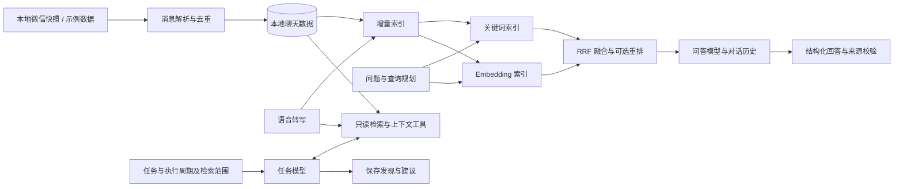

# WeChat Agent

[English](README.md) | [中文](README.zh-CN.md)

**把微信聊天记录变成可检索、可追问、可持续跟进的个人知识库。**

WeChat Agent 帮你从分散的私聊和群聊中找回信息：回顾过去的讨论，
用自然语言跨会话提问，也可以设置周期任务，持续整理你关心的动态。

群里分享的实习机会、朋友私聊中的准备建议，不必再分别翻找。
你可以把它们放在一个问题里检索、汇总，并展开原文核对。
对于需要持续关注的信息，则交给定时任务跟进。


*页面截图均使用虚构示例数据。*

## 核心功能

### 跨会话问答

用自然语言查询聊天记录，关联不同会话中的信息，并通过多轮对话继续追问。
回答附带可展开的来源，展示会话、发送者、时间和原文。
问答历史自动保存，切换页面或关闭网页不会中断后台请求。

例如：“最近有哪些实习机会？”“朋友之前给了我哪些面试准备建议？”


### 周期任务助手

填写任务内容，设置执行周期与检索范围。助手自主选择只读检索工具，
在指定时间窗内查找消息，将发现和建议保存为每次执行的结果。
任务支持立即执行、暂停，以及查看历史结果。

你可以用它检查尚未回复的私聊、追踪新增实习信息，或整理朋友推荐的餐厅。
助手只提供信息和建议，不会代替你发送微信消息。


### 聊天浏览与数据准备

以熟悉的聊天布局浏览私聊和群聊，搜索联系人，按需加载历史消息。
支持从已配置的本地微信数据自动或手动同步，展示支持的本地媒体，
并保存语音转写结果。

语音转文字、全文索引和语义索引可以依次执行。
新消息增量追加，转写变化更新对应记录及受影响的语义块。
RAG 配置页集中展示索引状态、检索调试和定时更新设置。

<details>
<summary>索引准备与检索配置</summary>


</details>

## 技术概览

系统基于同一份本地聊天数据，提供两条执行路径：
**面向问答的混合检索**，以及**面向周期任务的工具调用检索**。



- **混合检索**：规则驱动的查询规划、语义与关键词多路召回、联系人关联软信号、
  RRF 融合，以及可选的 LLM 重排。
- **可核查的回答**：模型返回结论和来源编号，代码校验引用，
  并从检索记录中生成会话、发送者和时间等来源信息。
- **任务执行**：本地调度器驱动模型调用工具，读取已同步消息。
  任务检索与问答向量索引是独立路径。
- **模型独立配置**：语音转写、聊天问答、任务助手、Embedding 和重排分别配置。

| 模块 | 技术 |
|---|---|
| 后端与调度 | Python 3.9+、本地 HTTP 服务、后台任务 |
| 存储与检索 | SQLite、FTS5/LIKE、进程内向量相似度计算 |
| 模型接入 | OpenAI 兼容 API、JSON Schema 结构化回答、工具调用 |
| 前端 | HTML、CSS、JavaScript |
| 本地数据处理 | PyCryptodome、Zstandard |

实现细节和代码入口见[架构说明](docs/ARCHITECTURE.md)。

## 快速开始

项目提供 **6 个会话、40 条虚构消息**。
浏览示例和使用本地关键词检索，无需安装微信或配置 API key。

```bash
git clone https://github.com/Fongkai777/wechat-agent.git
cd wechat-agent
python3 -m venv .venv
source .venv/bin/activate
python -m pip install -r requirements.txt

python -m wechat_agent.demo init       # 导入初始示例
python -m wechat_agent.demo index      # 建立全文索引
python -m wechat_agent.demo append     # 追加示例消息
python -m wechat_agent.demo index      # 增量更新索引
python -m wechat_agent.demo serve
```

访问 [localhost:8787](http://127.0.0.1:8787)。
示例数据和配置保存在 `.demo/`，与私人数据隔离。
如果端口已被占用，请先停止原服务，再启动示例。

在**模型配置**页设置模型后，即可使用生成回答、任务执行、Embedding 和语音转写，
这些功能可能产生服务商费用。问答模型需支持严格 JSON Schema，
任务模型还需支持工具调用。示例默认关闭 Embedding 和重排。

接入自己的聊天记录请参考[本地数据使用指南](docs/USAGE.zh-CN.md)。
微信解析能力取决于客户端版本以及本地数据是否可用。

## 已知限制与计划

- 只能读取本地已有的历史和媒体；媒体解析取决于格式、密钥及缓存是否可用。
- 对话历史参与回答生成；检索侧对模糊追问的查询改写仍在计划中。
- 来源校验让回答可追溯，但不能保证每个结论都得到引用原文的支持。
- 定时任务需要服务运行且电脑处于唤醒状态；较大的检索时间窗会增加处理时间与模型用量。
- 后续重点：多轮查询改写、更丰富的检索评测、引用支持度检查，以及大规模聊天数据的性能优化。

## 隐私与致谢

聊天数据存储在本地；使用云端模型时，相关文本或音频会发送给配置的服务商，
因此本项目并非纯离线应用。请仅处理你有权访问的数据。
私人数据库、密钥和缓存不提交到 Git。服务面向本机使用，不适合直接暴露到公网。

提取与解析参考了
[wechat-db-decrypt-macos](https://github.com/Thearas/wechat-db-decrypt-macos)、
[wechat-chat-history-mac](https://github.com/BIBOYANG425/wechat-chat-history-mac)、
[wechat-suite](https://github.com/raclen/wechat-suite)。
再分发上游代码前请确认许可证。本项目不是腾讯或微信官方产品。
